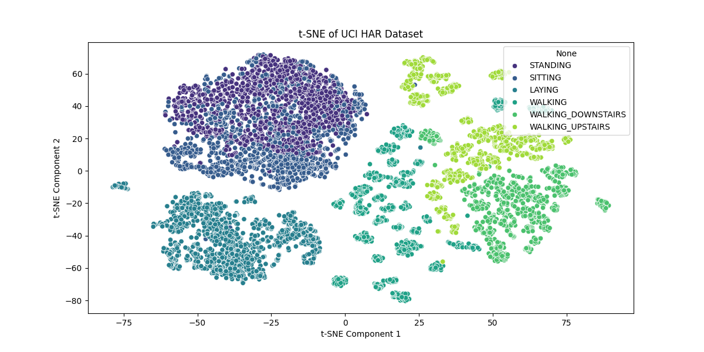
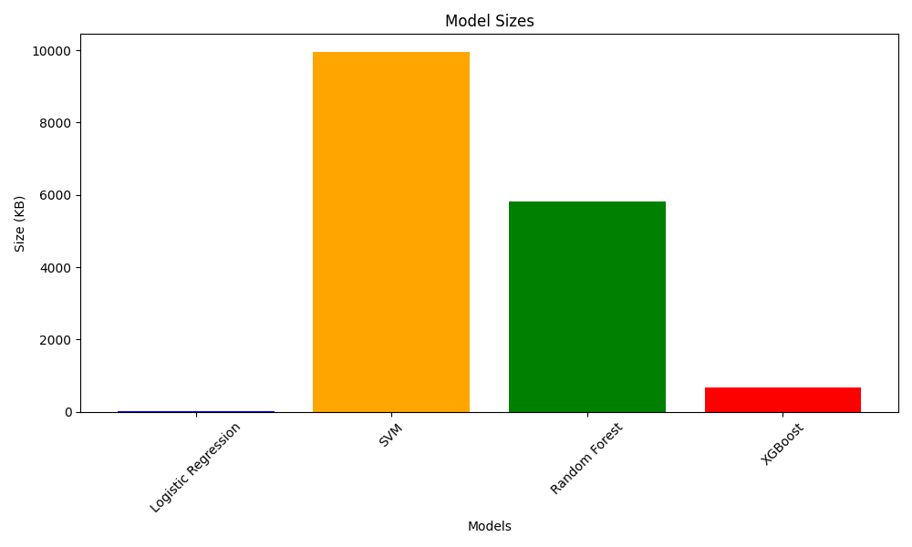
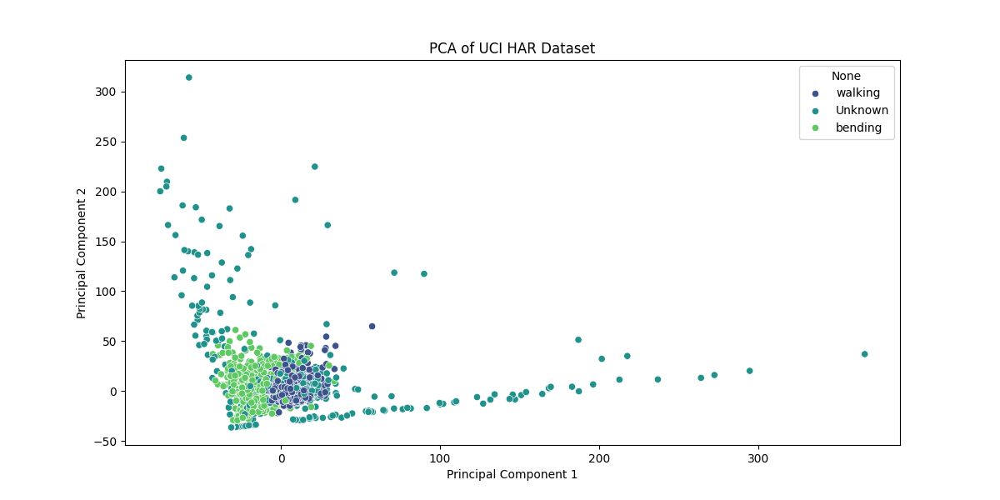
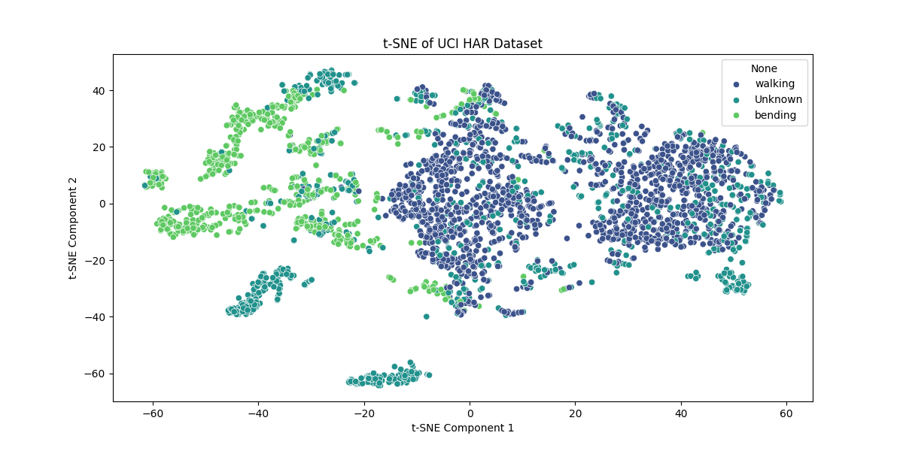
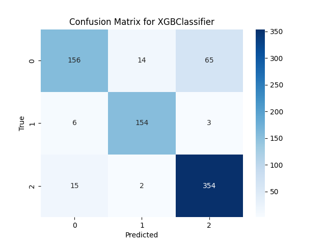
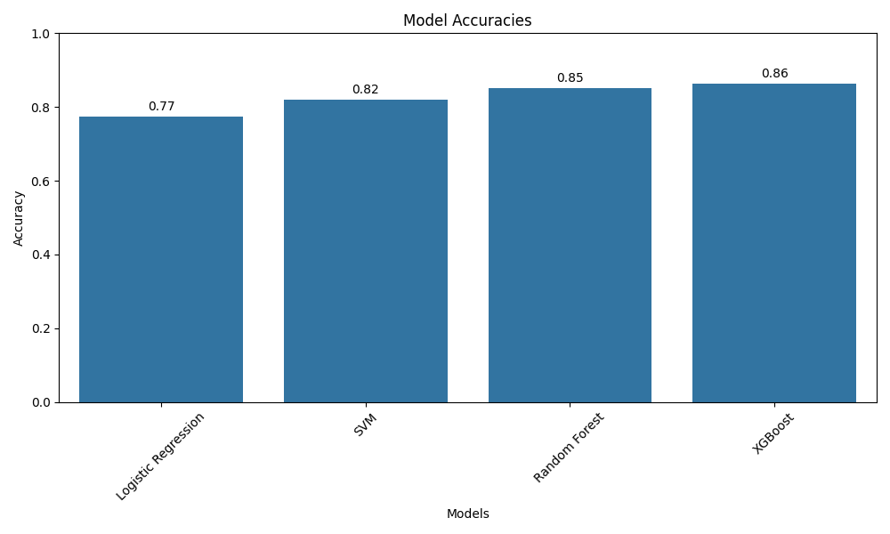
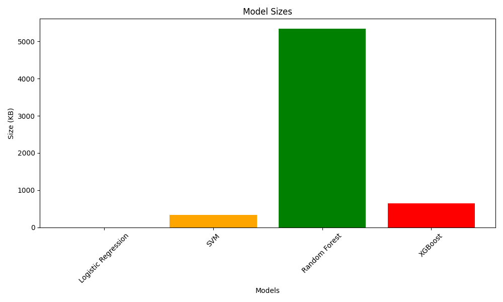

# 🧠 Deep Learning for IMU Classification

## 📌 Overview
This project investigates the use of deep learning models to classify human activity using time-series data from Inertial Measurement Units (IMUs). The classification task includes:

- **No Activity**
- **Walking**
- **Bending**

We use lab-collected IMU datasets to train and evaluate models, with a long-term goal of deploying on edge devices.

---

## 🎯 Objectives
- ✅ Train deep learning models for IMU-based activity classification.
- 📊 Compare model performance across different architectures (accuracy, F1-score).
- 📈 Present visualizations of evaluation results.
- ⏳ *Optional*: Compare global vs personalized models using transfer learning.
- 📦 *Optional*: Apply model compression techniques for edge deployment feasibility.

---

## 🚀 Expected Outcomes
- End-to-end pipeline for activity classification from IMU data.
- Performance benchmarks across model architectures.
- Insights into personalization and edge optimization.
- Final report and demo showcasing our results.

---

## 👥 Team Members & Roles

| Name             | Primary Focus                                   |
|------------------|--------------------------------------------------|
| **Maisoon Rahman** | Model architecture (CNNs, Transformers)         |
| **Liken Hananto**  | Data preprocessing & metrics evaluation         |
| **Devin Setiawan** | Transfer learning & model compression           |

> 🔄 **Note:** We will be working collaboratively on all parts of the project. The roles above indicate who is leading each component, not working in isolation.

---

# 📕 Tutorial

## 1. Environment Setup 🐍
You can use either Conda or venv to set up Python 3.12.3.
### Using Conda
```bash 
conda create -n myEnv python=3.12.3 -y 
conda activate myEnv
```
### Using venv
```bash 
python3.12 -m venv myEnv
source myEnv/bin/activate # On Windows use: myEnv\Scripts\activate
```
### Install the requirements needed
```bash 
pip install -r requirements.txt
```
### Set the PYTHONPATH
To make the utils folder available for imports throughout the project, set the PYTHONPATH:
```bash 
export PYTHONPATH="${PYTHONPATH}:$(pwd)"
```
On Windows Command Prompt, use:
```bash 
set PYTHONPATH=%PYTHONPATH%;%cd% 
# or for Powershell use:
$env:PYTHONPATH = "$env:PYTHONPATH;$PWD"
```

---

## 2. Running the code 🏃
The project is organized as follows:
### File structure
```plaintext
EECS836_FinalProject/    # Main project folder (contains .git, run everything here)
├── phase1_uci_dataset/   # Approach I: Heavy preprocessing
│   ├── data_visualization.py    # Visualize data (PCA, t-SNE, class distribution)
│   ├── resource_analysis.py     # Analyze model sizes
│   └── simple_models.py         # Traditional models (Logistic Regression, SVM, Random Forest, XGBoost)
│
├── phase2_uci_minimal/   # Approach II: Minimal preprocessing (mean, std only on UCI)
│   ├── data_visualization.py
│   ├── resource_analysis.py
│   └── simple_models.py
│
└── phase3_lab_data/      # Approach II applied to Lab dataset
    ├── data_preprocessor.py    # Transform raw lab data using sliding window
    ├── data_visualization.py
    ├── resource_analysis.py
    └── simple_models.py
```
To run the code for each phase, navigate to the project root (EECS836_FinalProject) and use:
### Running the script
```bash
# Example: Run simple models in phase 1
python phase1_uci_dataset/simple_models.py

# Example: Visualize data for phase 2
python phase2_uci_minimal/data_visualization.py

# Example: Preprocess raw lab data and run models
python phase3_lab_data/data_preprocessor.py
python phase3_lab_data/simple_models.py
# (If 'python' does not work, try 'python3')
```
✅ Make sure you have already run the environment setup steps and have the correct dependencies installed.

✅ All code should be run from the root directory (EECS836_FinalProject), so relative imports and file paths work properly.

---

# 🛠️ Methodology

## 📊 Approach I: Heavy Preprocessing with Traditional Machine Learning Models (UCI Dataset)
### Description: 
The first approach highlights the heavily preprocessed dataset from the Human Activity Recognition Using Smartphones (UCI dataset). The experiments were carried out with a group of 30 volunteers aged 19–48 years. Each person performed six activities (WALKING, WALKING_UPSTAIRS, WALKING_DOWNSTAIRS, SITTING, STANDING, LAYING) while wearing a smartphone (Samsung Galaxy S II) on their waist.

Using the smartphone’s embedded accelerometer and gyroscope, 3-axial linear acceleration and 3-axial angular velocity were captured at a constant rate of 50 Hz. The experiments were video-recorded to manually label the data. The obtained dataset was randomly partitioned, with 70% of volunteers for training data and 30% for test data.

The sensor signals were pre-processed by applying noise filters and sampled into fixed-width sliding windows of 2.56 seconds with 50% overlap (128 readings per window). To separate body motion and gravitational components, a Butterworth low-pass filter (0.3 Hz cutoff) was applied. From each window, a feature vector was created by extracting variables from both the time and frequency domains.

## ✂️ Approach II: Minimal Preprocessing with Traditional Machine Learning Models (UCI Minimal and Lab Dataset)
### Description:

In this approach, we apply minimal preprocessing to both the UCI and Lab datasets to retain simplicity and interpretability.

1. For the UCI dataset, we extract only basic statistical features — the mean and standard deviation — from the gyroscope and accelerometer signals along the x, y, and z axes, resulting in a total of 12 features. This keeps the feature set compact and focused on key signal characteristics.

2. For the Lab dataset, a similar philosophy is applied. After performing sliding window segmentation, we extract minimal features without heavy transformations or feature engineering.

### Motivation:

The rationale behind this minimal approach is rooted in the nature of our Lab dataset, which involves classifying only three activities: bending, walking, and other. Because the classification problem is relatively simple and well-separated, complex preprocessing may not be necessary — and could even introduce noise or overfitting. Using a small, informative set of features allows traditional machine learning models to perform effectively while remaining efficient and easier to interpret.

---

# 🚀 Results

## Phase I: UCI Dataset IMU Classification (Approach I)

## 📊 Data Visualization
 
### Figure 1: PCA projection of IMU signals on UCI Dataset Phase I

### Figure 2: t-SNE projection of IMU signals on UCI Dataset Phase I

### Figure 3: Class Distribution of UCI Dataset Phase I

## 📋 Confusion Matrices
Below we show the confusion matrix for the best-performing model, **Logistic Regression**, on the UCI dataset. All other confusion matrices from the evaluated models are available in `phase1_uci_dataset/figures`.


### Figure 4: Confusion Matrix for Best Model on UCI Dataset Phase I

## 🎯 Model Accuracies


### Figure 5: Model Accuracies on UCI Dataset Phase I

## 📦 Model Sizes


### Figure 6: Model Sizes on UCI Dataset Phase I

📦 Model Sizes:<br>
Logistic Regression → Size: 27.21 KB <br>
SVM                 → Size: 9949.67 KB<br>
Random Forest       → Size: 5809.88 KB<br>
XGBoost             → Size: 675.05 KB<br>

## Conclusion
Traditional machine learning models demonstrated outstanding performance in classifying IMU signals from the UCI dataset. We suspect that this strong performance is largely driven by the extensive preprocessing pipeline—particularly the use of techniques like Fast Fourier Transform (FFT)—which helps extract informative features from the raw signals.

However, despite the small size of the best-performing model (Logistic Regression, ~27 KB), the feasibility of deploying this approach on edge devices remains uncertain. The computational cost and memory requirements of the preprocessing steps may outweigh the model’s lightweight size. Future work should rigorously investigate the hardware requirements—such as RAM, flash memory, and processor specifications—necessary to run this pipeline in real-time on embedded or wearable systems.

---

## Phase II: UCI Dataset IMU Classification (Approach II)

## 📊 Data Visualization
 
### Figure 7: PCA projection of IMU signals on UCI Dataset Phase II

### Figure 8: t-SNE projection of IMU signals on UCI Dataset Phase II

### Figure 9: Class Distribution of UCI Dataset Phase II

## 📋 Confusion Matrices
Below we show the confusion matrix for the best-performing model, **XGBoost**, on the UCI dataset. All other confusion matrices from the evaluated models are available in `phase2_uci_minimal/figures`.


### Figure 10: Confusion Matrix for Best Model on UCI Dataset Phase II

## 🎯 Model Accuracies


### Figure 11: Model Accuracies on UCI Dataset Phase II

## 📦 Model Sizes


### Figure 12: Model Sizes on UCI Dataset Phase II

📦 Model Sizes:<br>
Logistic Regression → Size: 1.48 KB<br>
SVM                 → Size: 992.88 KB<br>
Random Forest       → Size: 20383.43 KB<br>
XGBoost             → Size: 1413.07 KB<br>

## Conclusion
In this phase, we evaluated traditional machine learning models on the UCI dataset using only simple preprocessing (mean and standard deviation of IMU signals). As expected, this led to a significant drop in accuracy—highlighting the importance of feature engineering. The best-performing model, **XGBoost**, achieved an accuracy of **81%**, a notable decrease from **96%** achieved by Logistic Regression in Phase I with heavy preprocessing.

An interesting observation is the large increase in model size for tree-based algorithms. Both **Random Forest** and **XGBoost** became substantially larger, which we believe is inherent to their structure—when presented with less informative features, they likely need to build more trees to maintain performance. In contrast, **SVM** and **Logistic Regression** remained compact.

From an edge deployment perspective, this minimal preprocessing approach is highly promising. Both **Logistic Regression** and **XGBoost** models remain under **1 MB**, and the lightweight preprocessing (mean and std) can be easily executed with devices having **<512 KB RAM** and **<2 MB flash memory**. This makes the approach viable for real-time, low-power embedded systems.

---

## Phase III: UCI Dataset IMU Classification (Approach II)

## 📊 Data Visualization
 
### Figure 13: PCA projection of IMU signals on Lab Dataset

### Figure 14: t-SNE projection of IMU signals on Lab Dataset

### Figure 15: Class Distribution of Lab Dataset

## 📋 Confusion Matrices
Below we show the confusion matrix for the best-performing model, **XGBoost**, on the UCI dataset. All other confusion matrices from the evaluated models are available in `phase3_lab_data/figures`.


### Figure 16: Confusion Matrix for Best Model on Lab Dataset

## 🎯 Model Accuracies


### Figure 17: Model Accuracies on Lab Dataset

## 📦 Model Sizes


### Figure 18: Model Sizes on Lab Dataset

📦 Model Sizes:<br>
Logistic Regression → Size: 1.44 KB<br>
SVM                 → Size: 329.86 KB<br>
Random Forest       → Size: 5340.00 KB<br>
XGBoost             → Size: 650.00 KB<br>

## Conclusion

Building on the promising results from the UCI dataset using minimal preprocessing, we applied the same strategy to our Lab dataset. The outcome was encouraging: **XGBoost** achieved an improved accuracy of 86%, up from 81% in the previous phase. This performance gain is likely due to the reduced complexity of our classification task, which involves only **3 activity classes** compared to 6 in the UCI dataset. Tree-based models like XGBoost appear to thrive even with limited, simple features under such conditions.

Interestingly, model sizes also **shrank**, despite our Lab dataset including **twice as many features** (both upper and lower body IMU data). This supports our earlier observations about the behavior of tree-based models and strengthens the case for deploying this pipeline on edge devices. With **minimal preprocessing** and a compact XGBoost model, 86% accuracy is achievable even on **microcontrollers with <1MB flash**, making this approach highly practical for real-world, resource-constrained applications.
